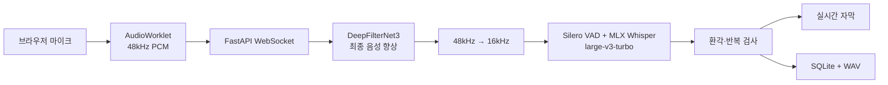
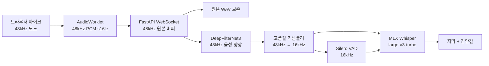

# EasyListener MLX Whisper 한국어 음성인식 설계

## 1. 결론

EasyListener의 로컬 한국어 음성인식 엔진은 다음 구성을 기본으로 사용합니다.

| 구분 | 선택 |
| --- | --- |
| 실행 환경 | Apple Silicon Mac |
| STT 엔진 | `mlx-whisper` |
| 기본 모델 | `mlx-community/whisper-large-v3-turbo` |
| 입력 형식 | 48kHz 모노 PCM `s16le` 수집, 16kHz Whisper 입력 |
| 음성 향상 | DeepFilterNet3 48kHz, 원본 폴백 |
| 음성 구간 검출 | Silero VAD ONNX |
| API | FastAPI + WebSocket |
| 저장 | 로컬 WAV + SQLite |

`large-v3-turbo`는 `large-v3`의 디코더를 32개 층에서 4개 층으로 줄인
809M 파라미터 다국어 모델이다. 한국어 받아쓰기를 지원하며, Apple
Silicon에서는 MLX를 통해 통합 메모리와 GPU를 효율적으로 사용할 수 있다.

이 모델은 실시간 자막과 로컬 기록에 적합하다. 다만 법률 기록처럼 오류 비용이
높은 용도에서는 모델 출력 자체를 확정 기록으로 간주하지 않고, 검토 표시와
한국어 평가셋 검증을 함께 운영해야 한다.

## 2. 현재 구현



이전 구현은 `whisper.cpp` 서버를 별도 프로세스로 실행했지만 현재 구현은
FastAPI 프로세스 안에서 `mlx_whisper.transcribe()`를 직접 호출한다.

직접 호출 방식의 장점은 다음과 같다.

- 별도 STT HTTP 서버와 포트가 필요 없다.
- PCM을 WAV multipart 요청으로 다시 직렬화하지 않는다.
- 모델 로딩과 추론 잠금을 Python 계층에서 관리한다.
- MLX 모델 경로와 디코딩 설정을 애플리케이션 코드에서 일관되게 관리한다.

## 3. DeepFilterNet3 도입 검토

### 3.1 결론

DeepFilterNet3를 Whisper 앞단의 **음성 향상 블록**으로 구현했다. 팬 소음,
공조기, 차량음처럼 지속적인 배경 잡음이 있는 녹음에서는
Whisper에 전달되는 음성을 더 선명하게 만들 가능성이 있다. 하지만 모든 녹음에
강제로 적용하면 깨끗한 음성의 자음이나 고주파 성분을 훼손해 오히려 한국어
인식률이 낮아질 수 있으므로 다음 원칙으로 도입한다.

- 기본값은 활성화하며 `ENABLE_DEEPFILTER=false`로 끌 수 있다.
- 원본 녹음을 덮어쓰지 않는다.
- 48kHz에서 노이즈를 제거한 뒤 Whisper용 16kHz로 변환한다.
- DeepFilterNet3 실패 시 원본 음성을 16kHz로 변환해 전사를 계속한다.
- 깨끗한 음성과 잡음 음성의 CER을 각각 비교한 뒤 기본 활성화 여부를 결정한다.

DeepFilterNet3는 음성 생성과 청각 지식을 활용하는 실시간 단일 채널 음성 향상
모델이다. 공식 자료는 단일 스레드 노트북 CPU에서 RTF 0.19를 보고하지만, 이
수치는 EasyListener의 M3, Python, PyTorch, MLX 동시 실행 조건을 보장하지
않으므로 로컬 벤치마크가 필요하다.

### 3.2 샘플레이트 제약

공식 DeepFilterNet 구현은 48kHz full-band 오디오를 전제로 한다. 기존
`public/audio-worklet.js`는 브라우저 오디오를 서버 전송 전에 16kHz로
낮췄지만, 현재 구현은 48kHz로 전송한다. 16kHz 신호를 48kHz로 다시 올려도
이미 제거된 8kHz 이상의 정보는 복원되지 않으므로 다음과 같은 단순 연결은
사용하지 않는다.

```text
현재 16kHz PCM → 48kHz 업샘플 → DeepFilterNet3 → 16kHz
```

권장 파이프라인은 다음과 같다.



네트워크 전송량은 16kHz 모노 PCM의 약 32KB/s에서 48kHz 모노 PCM의 약
96KB/s로 증가하지만 로컬 WebSocket 용도에서는 수용 가능한 수준이다.

### 3.3 단계적 적용안

#### 1단계: 최종 전사에만 적용 — 구현 완료

현재 최종 저장 시 전체 48kHz 녹음에 배치 방식으로 DeepFilterNet3를 적용한다.

1. 브라우저는 48kHz 모노 PCM을 전송한다.
2. 백엔드는 48kHz 원본을 보존한다.
3. 녹음 중에는 원본을 상태 유지형 리샘플러로 16kHz로 변환해 VAD와 임시
   자막에 사용한다.
4. 녹음 종료 시 원본 전체에 DeepFilterNet3를 적용한다.
5. 향상된 48kHz 음성을 16kHz로 변환한다.
6. 향상된 전체 음성을 MLX Whisper의 연속 디코딩에 전달한다.
7. DeepFilterNet3 오류가 발생하면 원본 기반 전사로 폴백한다.

이 방식은 기존 실시간 자막 지연을 크게 바꾸지 않으면서 최종 자막의 효과부터
검증할 수 있다.

#### 2단계: 실시간 향상

1단계의 CER과 RTF가 기준을 통과한 뒤에만 스트리밍 DeepFilterNet3를 검토한다.
스트리밍 단계에서는 STFT 상태와 모델 상태를 세션별로 유지하고, 임의 길이
WebSocket 프레임을 모델 hop 크기에 맞춰 누적해야 한다. 배치용 `enhance()`
함수를 짧은 조각마다 독립 호출하면 경계 잡음과 음절 손실이 생길 수 있으므로
실시간 구현으로 간주하지 않는다.

### 3.4 백엔드 블록 설계

구현된 모듈의 책임은 다음과 같다.

| 파일 | 책임 |
| --- | --- |
| `backend/noise_suppression.py` | 모델 1회 로딩, 48kHz 향상, 폴백, 성능 측정 |
| `backend/audio_processing.py` | 48kHz↔16kHz 변환과 스트리밍 상태 관리 |
| `backend/app.py` | 원본/향상 버퍼 분리, 처리 순서, WebSocket 진단값 |
| `backend/storage.py` | 원본 WAV와 향상 WAV 경로를 구분해 저장 |
| `backend/test_noise_suppression.py` | 무음·깨끗한 음성·잡음·폴백 회귀 테스트 |

DeepFilterNet3 모델은 요청마다 다시 로딩하지 않고 FastAPI 시작 시 한 번
초기화한다. Python API는 `init_df()`와 `enhance()`를 사용하며, 모델 입력은
`[channel, samples]` 형태의 48kHz `float32` 텐서로 제한한다. 버전별
`init_df()` 반환값 차이가 있을 수 있으므로 설치 버전을 고정하고 테스트한다.

개념적인 처리 인터페이스는 다음과 같다.

```python
class NoiseSuppressor:
    sample_rate = 48_000

    def enhance(self, audio_48k: np.ndarray) -> EnhancementResult:
        """원본은 변경하지 않고 향상 음성과 진단값을 반환한다."""
```

현재 설정에서는 공격적인 후처리를 피한다.

- 모델: `DeepFilterNet3`
- post-filter: 비활성화
- delay compensation: 활성화
- 최대 감쇠량: 18dB
- 실행 장치: 우선 CPU
- 모델 실행: 전용 잠금으로 한 번에 하나

PyTorch MPS는 연산 호환성과 메모리 사용량을 별도로 검증한 뒤 사용한다.
MLX Whisper와 PyTorch가 동시에 GPU 및 통합 메모리를 사용하면 처리 지연이나
메모리 압박이 커질 수 있기 때문이다.

### 3.5 브라우저 전처리와의 관계

현재 마이크 요청은 `echoCancellation=true`, `noiseSuppression=true`를 사용한다.
DeepFilterNet3까지 활성화하면 브라우저와 서버에서 노이즈 억제가 두 번 적용될
수 있다.

- `echoCancellation`은 DeepFilterNet3가 대체하지 않으므로 유지한다.
- DeepFilterNet3 A/B 평가에서는 브라우저 `noiseSuppression`을 끈 조합도
  반드시 비교한다.
- 브라우저 종류마다 내장 DSP가 다르므로 실제 적용 여부를 진단값에 기록한다.
- 자동 이득 조절을 사용할 경우 클리핑과 숨소리 증폭 여부를 별도로 확인한다.

### 3.6 저장 및 장애 처리

감사와 재처리를 위해 다음 데이터를 구분한다.

| 데이터 | 보존 정책 |
| --- | --- |
| 원본 48kHz WAV | 항상 보존하는 기준 음원 |
| 향상 48kHz WAV | 기능 활성화 시 선택적으로 보존 |
| Whisper 입력 16kHz PCM | 기본적으로 메모리에서만 사용 |
| 최종 자막 | 사용한 오디오 경로와 향상 설정을 진단값에 기록 |

향상 블록은 STT의 단일 실패 지점이 되어서는 안 된다. 모델 로딩 실패, 처리
타임아웃, NaN/Infinity, 출력 길이 불일치, 무음 출력이 발생하면
`noiseSuppressionFallback=true`를 남기고 원본 경로로 전환한다.

권장 진단값:

```json
{
  "noiseSuppression": true,
  "noiseSuppressionModel": "DeepFilterNet3",
  "noiseSuppressionLatencyMs": 840,
  "noiseSuppressionRealtimeFactor": 0.07,
  "noiseSuppressionFallback": false,
  "browserNoiseSuppression": false,
  "sourceSampleRate": 48000,
  "whisperSampleRate": 16000
}
```

### 3.7 설치 검토

공식 Python 경로는 PyTorch와 `deepfilternet` 패키지를 사용한다. 현재 검증된
조합은 다음과 같다.

```text
deepfilternet==0.5.6
DeepFilterLib==0.5.6
torch==2.5.1
torchaudio==2.5.1
numpy==1.26.4
```

PyPI의 `deepfilternet 0.5.6`은 Python 3.11을 지원한다. 별도
`DeepFilterLib 0.5.6`에도 CPython 3.11 및 macOS 11+ ARM64 wheel이 있어 현재
Python 3.11 Apple Silicon 환경과 설치 조건은 맞는다. 다만 패키지의 마지막
PyPI 배포가 2023년이므로 `backend/requirements.txt`에 바로 추가하기 전에
최신 torchaudio에서는 `deepfilternet 0.5.6`이 사용하는 이전 backend API가
제거됐기 때문에 위 버전을 함께 고정한다. 장시간 음원은 별도 평가가 필요하다.

### 3.8 품질 승인 기준

노이즈 제거의 음질이 좋아졌다는 주관적 판단만으로 기본 활성화하지 않는다.
같은 원본에 대해 다음 세 경로를 비교한다.

1. 브라우저 노이즈 억제만 사용
2. 브라우저 노이즈 억제 해제 + DeepFilterNet3
3. 브라우저 노이즈 억제 + DeepFilterNet3

| 평가 항목 | 승인 기준 예시 |
| --- | --- |
| 잡음 음성 CER | 기존보다 유의미하게 감소 |
| 깨끗한 음성 CER | 기존 대비 1%p 이상 악화하지 않음 |
| 고유명사·숫자 정확도 | 기존보다 악화하지 않음 |
| 음절 누락률 | 기존보다 증가하지 않음 |
| 향상 RTF | M3에서 0.25 이하 |
| 전체 최종 처리 RTF | 현재 서비스 목표 이내 |
| 폴백 성공률 | 향상 실패 시 원본 전사 100% 수행 |

특히 한국어의 ㅅ, ㅆ, ㅈ, ㅊ 같은 고주파 자음과 낮은 음량의 어미가 과도하게
제거되지 않는지 확인한다.

## 4. 한국어 인식 설정

기본 디코딩 설정은 다음과 같다.

```python
mlx_whisper.transcribe(
    audio,
    path_or_hf_repo=model_path,
    language="ko",
    task="transcribe",
    temperature=0.0,
    condition_on_previous_text=True,
    initial_prompt=legal_prompt,
    compression_ratio_threshold=2.4,
    logprob_threshold=-1.0,
    no_speech_threshold=0.6,
)
```

설정 원칙은 다음과 같다.

- `language="ko"`로 한국어를 고정해 짧은 구간의 언어 오판을 줄인다.
- `task="transcribe"`를 사용한다. `turbo`는 음성 번역용으로 사용하지 않는다.
- `temperature=0.0`의 greedy decoding으로 결과 재현성을 높인다.
- `mlx-whisper 0.4.3`은 beam search가 구현되어 있지 않아 `beam_size`를
  전달하지 않는다.
- 최종 전사는 전체 녹음을 한 번에 전달하고 `condition_on_previous_text=True`로 이전 구간의 문맥을 유지한다.
- VAD는 무음 판정과 진단에만 사용하며, 발화 구간을 잘라 전사하지 않아 경계의 단어와 문장이 누락되지 않게 한다.
- 임시 자막에는 전문용어 프롬프트를 사용하지 않는다.
- `ENABLE_LEGAL_PROMPT=true`일 때만 최종 자막에 짧은 전문용어 목록을 사용한다.

## 5. VAD 적용 원칙

최종 전사는 전체 녹음 파일을 일정 간격으로 자르지 않고 한 번의 MLX Whisper
연속 디코딩으로 처리한다. Silero VAD는 실시간 발화 이벤트, 임시 자막,
무음 판정과 진단에 사용하며 최종 음성의 중간 구간을 잘라내지 않는다.

처리 순서는 다음과 같다.

1. WebSocket으로 수신한 PCM을 원본 버퍼에 보존한다.
2. Silero VAD가 발화 시작과 종료를 검출한다.
3. 발화 시작 시 약 1초의 선행 오디오를 포함한다.
4. 800ms 침묵 후 발화 종료 범위를 확정한다.
5. 겹치거나 이어진 음성 범위를 병합해 진단값으로 기록한다.
6. 녹음 종료 시 전체 음성을 MLX Whisper에 한 번 전달한다.

VAD가 음성을 찾지 못해도 오디오 에너지 검사에서 유효 신호가 확인되면 전체
녹음을 MLX Whisper에 전달한다. 이 폴백은 원거리 음성, 스피커 재생음, 낮은 VAD
확률의 음성이 전혀 전사되지 않는 문제를 방지하며 진단값 `vadFallback=true`로
기록된다. VAD가 동작하지 않는 동안에도 최근 8초 구간으로 임시 자막을 갱신한다.

## 6. 전문용어 프롬프트

전문용어 프롬프트는 인식해야 할 단어를 나열하는 용도로만 사용한다. 설명문,
명령문, 특정 사건의 인명은 기본 프롬프트에 넣지 않는다.

잘못된 예:

```text
이 녹음은 법률 사건에 대한 설명입니다.
주요 인명: 박수홍, 김다예.
```

권장 예:

```text
탄원서, 절절한 심정, 공소사실, 피고인, 집행유예, 정상참작.
```

긴 프롬프트를 모든 디코딩 창에 반복해서 전달하면 짧은 음성이나 잡음 구간에서
프롬프트 내용이 그대로 생성될 수 있다. 현재 구현은 직전 인식 결과를 다음 창의
프롬프트로 다시 전달하지 않는다.

## 7. 환각 및 검토 판정

Whisper의 `avg_logprob`은 보정된 사용자 신뢰도 확률이 아니다. 따라서
`exp(avg_logprob)` 같은 값을 정확도 백분율로 표시하지 않는다.

현재 구현은 다음 신호를 종합해 `reviewRequired`를 설정한다.

| 검토 사유 | 기준 |
| --- | --- |
| `low_log_probability` | `avg_logprob < -0.65` |
| `high_compression_ratio` | `compression_ratio > 2.4` |
| `possible_non_speech` | `no_speech_prob > 0.6` |
| `character_repetition` | 한 문자가 긴 문장의 55% 이상 |
| `repeated_text` | 인접 구간에서 동일 문장이 반복 |
| `dictionary_correction` | 사전 치환이 적용됨 |

인접한 동일 문장은 하나의 구간으로 합치고 검토 대상으로 표시한다. 원문과 사전
치환 결과는 함께 보존하여 사용자가 변경 내용을 확인할 수 있게 한다.

## 8. 모델 선택 기준

| 모델 | 장점 | 주의점 | 권장 용도 |
| --- | --- | --- | --- |
| `large-v3-turbo` FP16 | 속도와 정확도의 균형 | `large-v3`보다 소폭 정확도 저하 | 기본 실시간 STT |
| `large-v3-turbo-q4` | 메모리와 저장 공간 절감 | 한국어·고유명사 품질 재검증 필요 | 저메모리 장비 |
| `large-v3` FP16 | 상대적으로 높은 정확도 | 속도와 메모리 비용 증가 | 최종 법률 기록 비교군 |

M3 24GB 환경에서는 FP16 `large-v3-turbo`를 먼저 검증한다. Q4 모델은 속도나
메모리 문제가 실제로 확인된 뒤 동일 평가셋으로 품질을 비교하고 채택한다.

## 9. 설치

필수 조건은 다음과 같다.

- Apple Silicon Mac
- macOS
- Python 3.11
- Node.js 22 이상

환경과 모델을 준비한다.

```bash
./setup_demo.sh
```

이 스크립트는 다음 작업을 수행한다.

- `.demo/venv` Python 가상환경 생성
- `mlx-whisper`, FastAPI, ONNX Runtime 설치
- DeepFilterNet3, DeepFilterLib, PyTorch 2.5.1 설치
- DeepFilterNet3 모델 사전 다운로드와 로딩 확인
- Silero VAD ONNX 모델 다운로드
- `mlx-community/whisper-large-v3-turbo`를
  `.demo/models/whisper-large-v3-turbo`에 다운로드

데모를 실행한다.

```bash
./run_demo.sh
```

기본 접속 주소는 `http://localhost:5173/`이다. FastAPI와 MLX Whisper는 같은
백엔드 프로세스에서 실행된다.

## 10. 환경 변수

| 변수 | 기본값 | 설명 |
| --- | --- | --- |
| `WHISPER_MODEL_NAME` | `large-v3-turbo` | 화면과 진단에 표시할 모델명 |
| `WHISPER_MODEL_PATH` | `.demo/models/whisper-large-v3-turbo` | MLX 모델 경로 |
| `WHISPER_MODEL_REPO` | `mlx-community/whisper-large-v3-turbo` | 설치 시 모델 저장소 |
| `SILERO_MODEL_PATH` | `.demo/models/silero_vad.onnx` | VAD 모델 경로 |
| `ENABLE_LEGAL_PROMPT` | `false` | 최종 전사의 법률용어 프롬프트 사용 |
| `LOW_CONFIDENCE_LOGPROB` | `-0.65` | 낮은 로그 확률 검토 기준 |
| `NO_SPEECH_REVIEW_THRESHOLD` | `0.6` | 비음성 검토 기준 |
| `COMPRESSION_RATIO_REVIEW_THRESHOLD` | `2.4` | 반복 출력 검토 기준 |
| `ENABLE_DEEPFILTER` | `true` | DeepFilterNet3 최종 음성 향상 사용 |
| `DEEPFILTER_MODEL` | `DeepFilterNet3` | 음성 향상 모델 |
| `DEEPFILTER_ATTEN_LIMIT_DB` | `18` | 최대 노이즈 감쇠량 |

## 11. 품질 평가

모델 채택 여부는 체감이 아니라 정답 전사가 포함된 고정 평가셋으로 결정한다.

최소 평가 구성:

- 한국어 일반 대화 30개
- 법률·재판 용어 포함 음성 30개
- 고유명사와 숫자 포함 음성 20개
- 원거리·잡음·작은 음량 음성 20개
- 침묵과 비음성 오디오 20개

측정 항목:

| 항목 | 설명 |
| --- | --- |
| CER | 한국어 문자 오류율 |
| 고유명사 정확도 | 인명·기관명·법률용어 일치율 |
| 숫자 정확도 | 날짜·형량·금액 인식률 |
| 환각률 | 정답에 없는 문장이 생성된 파일 비율 |
| 누락률 | 실제 발화가 빠진 비율 |
| RTF | 추론 시간 / 음성 구간 시간 |
| 첫 자막 지연 | 발화 후 임시 자막까지 걸린 시간 |
| 향상 전후 CER | 동일 음원의 DeepFilterNet3 적용 효과 |
| 향상 RTF | DeepFilterNet3 처리 시간 / 음원 시간 |

비교 대상은 최소한 다음 세 가지로 구성한다.

1. MLX `large-v3-turbo` FP16
2. MLX `large-v3` FP16
3. 기존 `whisper.cpp large-v3-turbo` 기준 결과

## 12. 알려진 제약

- MLX 실행 경로는 Apple Silicon에 종속된다.
- 첫 추론은 모델 로딩 때문에 이후 요청보다 느릴 수 있다.
- 한 번에 하나의 추론만 실행하도록 잠금을 사용하므로 다중 사용자 서버용 구조는
  아니다.
- 화자 분리는 제공하지 않는다.
- 전문용어 사전 치환은 의미를 바꿀 수 있으므로 항상 검토 대상으로 표시한다.
- 법률 기록의 정확성을 모델 로그 확률만으로 보증할 수 없다.
- DeepFilterNet3 적용을 위해 WebSocket 입력 대역폭이 기존 16kHz보다 약 3배
  증가한다.
- PyTorch와 MLX를 한 프로세스에서 함께 사용하면 통합 메모리 사용량과 지연이
  증가할 수 있다.
- 강한 노이즈 억제는 한국어 자음과 낮은 음량의 어미를 손상시킬 수 있다.

## 13. 관련 파일

| 파일 | 역할 |
| --- | --- |
| `backend/transcription.py` | MLX 추론, 음성 창 분할, 환각 판정 |
| `backend/vad_processor.py` | Silero VAD 스트리밍 처리 |
| `backend/app.py` | WebSocket 수신, VAD 범위 수집, 저장 |
| `backend/legal_prompt.txt` | 최종 전사용 짧은 전문용어 목록 |
| `backend/legal_corrections.json` | 검토가 필요한 사전 치환 |
| `backend/test_transcription.py` | 병합·반복·VAD 회귀 테스트 |
| `setup_demo.sh` | MLX 의존성과 모델 설치 |
| `run_demo.sh` | FastAPI/MLX와 웹 화면 실행 |
| `backend/noise_suppression.py` | DeepFilterNet3 모델, 향상, 원본 폴백 |
| `backend/audio_processing.py` | 48kHz/16kHz 배치·스트리밍 변환 |
| `backend/test_audio_processing.py` | 리샘플링·폴백·이중 WAV 저장 테스트 |

## 14. 참고 자료

- [OpenAI Whisper](https://github.com/openai/whisper)
- [MLX Whisper](https://github.com/ml-explore/mlx-examples/tree/main/whisper)
- [MLX large-v3-turbo](https://huggingface.co/mlx-community/whisper-large-v3-turbo)
- [OpenAI large-v3-turbo](https://huggingface.co/openai/whisper-large-v3-turbo)
- [Silero VAD](https://github.com/snakers4/silero-vad)
- [DeepFilterNet 공식 저장소](https://github.com/Rikorose/DeepFilterNet)
- [DeepFilterNet3 논문](https://arxiv.org/abs/2305.08227)
- [deepfilternet 0.5.6 PyPI](https://pypi.org/project/deepfilternet/)
- [DeepFilterLib 0.5.6 PyPI](https://pypi.org/project/deepfilterlib/)
