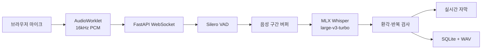

# EasyListner MLX Whisper 한국어 음성인식 설계

## 1. 결론

EasyListner의 로컬 한국어 음성인식 엔진은 다음 구성을 기본으로 사용합니다.

| 구분 | 선택 |
| --- | --- |
| 실행 환경 | Apple Silicon Mac |
| STT 엔진 | `mlx-whisper` |
| 기본 모델 | `mlx-community/whisper-large-v3-turbo` |
| 입력 형식 | 16kHz 모노 PCM `s16le` |
| 음성 구간 검출 | Silero VAD ONNX |
| API | FastAPI + WebSocket |
| 저장 | 로컬 WAV + SQLite |

`large-v3-turbo`는 `large-v3`의 디코더를 32개 층에서 4개 층으로 줄인
809M 파라미터 다국어 모델이다. 한국어 받아쓰기를 지원하며, Apple
Silicon에서는 MLX를 통해 통합 메모리와 GPU를 효율적으로 사용할 수 있다.

이 모델은 실시간 자막과 로컬 기록에 적합하다. 다만 법률 기록처럼 오류 비용이
높은 용도에서는 모델 출력 자체를 확정 기록으로 간주하지 않고, 검토 표시와
한국어 평가셋 검증을 함께 운영해야 한다.

## 2. 현재 구현



이전 구현은 `whisper.cpp` 서버를 별도 프로세스로 실행했지만 현재 구현은
FastAPI 프로세스 안에서 `mlx_whisper.transcribe()`를 직접 호출한다.

직접 호출 방식의 장점은 다음과 같다.

- 별도 STT HTTP 서버와 포트가 필요 없다.
- PCM을 WAV multipart 요청으로 다시 직렬화하지 않는다.
- 모델 로딩과 추론 잠금을 Python 계층에서 관리한다.
- MLX 모델 경로와 디코딩 설정을 애플리케이션 코드에서 일관되게 관리한다.

## 3. 한국어 인식 설정

기본 디코딩 설정은 다음과 같다.

```python
mlx_whisper.transcribe(
    audio,
    path_or_hf_repo=model_path,
    language="ko",
    task="transcribe",
    temperature=0.0,
    condition_on_previous_text=False,
    initial_prompt=legal_prompt,
    compression_ratio_threshold=2.4,
    logprob_threshold=-1.0,
    no_speech_threshold=0.6,
)
```

설정 원칙은 다음과 같다.

- `language="ko"`로 한국어를 고정해 짧은 구간의 언어 오판을 줄인다.
- `task="transcribe"`를 사용한다. `turbo`는 음성 번역용으로 사용하지 않는다.
- `temperature=0.0`의 greedy decoding으로 결과 재현성을 높인다.
- `mlx-whisper 0.4.3`은 beam search가 구현되어 있지 않아 `beam_size`를
  전달하지 않는다.
- `condition_on_previous_text=False`로 장시간 녹음의 반복 루프를 줄인다.
- 임시 자막에는 전문용어 프롬프트를 사용하지 않는다.
- `ENABLE_LEGAL_PROMPT=true`일 때만 최종 자막에 짧은 전문용어 목록을 사용한다.

## 4. VAD 적용 원칙

최종 전사는 전체 녹음 파일을 일정 간격으로 자르는 방식이 아니라 Silero VAD가
확정한 음성 범위만 처리한다.

처리 순서는 다음과 같다.

1. WebSocket으로 수신한 PCM을 원본 버퍼에 보존한다.
2. Silero VAD가 발화 시작과 종료를 검출한다.
3. 발화 시작 시 약 1초의 선행 오디오를 포함한다.
4. 800ms 침묵 후 발화 종료 범위를 확정한다.
5. 겹치거나 이어진 음성 범위를 병합한다.
6. 25초보다 긴 발화만 1.5초 중첩 창으로 나눈다.
7. 확정된 음성 범위만 MLX Whisper에 전달한다.

VAD가 음성을 찾지 못해도 오디오 에너지 검사에서 유효 신호가 확인되면 전체
녹음을 MLX Whisper에 전달한다. 이 폴백은 원거리 음성, 스피커 재생음, 낮은 VAD
확률의 음성이 전혀 전사되지 않는 문제를 방지하며 진단값 `vadFallback=true`로
기록된다. VAD가 동작하지 않는 동안에도 최근 8초 구간으로 임시 자막을 갱신한다.

## 5. 전문용어 프롬프트

전문용어 프롬프트는 인식해야 할 단어를 나열하는 용도로만 사용한다. 설명문,
명령문, 특정 사건의 인명은 기본 프롬프트에 넣지 않는다.

잘못된 예:

```text
이 녹음은 법률 사건에 대한 설명입니다.
주요 인명: 박수홍, 김다예.
```

권장 예:

```text
탄원서, 절절한 심정, 공소사실, 피고인, 집행유예, 정상참작.
```

긴 프롬프트를 모든 디코딩 창에 반복해서 전달하면 짧은 음성이나 잡음 구간에서
프롬프트 내용이 그대로 생성될 수 있다. 현재 구현은 직전 인식 결과를 다음 창의
프롬프트로 다시 전달하지 않는다.

## 6. 환각 및 검토 판정

Whisper의 `avg_logprob`은 보정된 사용자 신뢰도 확률이 아니다. 따라서
`exp(avg_logprob)` 같은 값을 정확도 백분율로 표시하지 않는다.

현재 구현은 다음 신호를 종합해 `reviewRequired`를 설정한다.

| 검토 사유 | 기준 |
| --- | --- |
| `low_log_probability` | `avg_logprob < -0.65` |
| `high_compression_ratio` | `compression_ratio > 2.4` |
| `possible_non_speech` | `no_speech_prob > 0.6` |
| `character_repetition` | 한 문자가 긴 문장의 55% 이상 |
| `repeated_text` | 인접 구간에서 동일 문장이 반복 |
| `dictionary_correction` | 사전 치환이 적용됨 |

인접한 동일 문장은 하나의 구간으로 합치고 검토 대상으로 표시한다. 원문과 사전
치환 결과는 함께 보존하여 사용자가 변경 내용을 확인할 수 있게 한다.

## 7. 모델 선택 기준

| 모델 | 장점 | 주의점 | 권장 용도 |
| --- | --- | --- | --- |
| `large-v3-turbo` FP16 | 속도와 정확도의 균형 | `large-v3`보다 소폭 정확도 저하 | 기본 실시간 STT |
| `large-v3-turbo-q4` | 메모리와 저장 공간 절감 | 한국어·고유명사 품질 재검증 필요 | 저메모리 장비 |
| `large-v3` FP16 | 상대적으로 높은 정확도 | 속도와 메모리 비용 증가 | 최종 법률 기록 비교군 |

M3 24GB 환경에서는 FP16 `large-v3-turbo`를 먼저 검증한다. Q4 모델은 속도나
메모리 문제가 실제로 확인된 뒤 동일 평가셋으로 품질을 비교하고 채택한다.

## 8. 설치

필수 조건은 다음과 같다.

- Apple Silicon Mac
- macOS
- Python 3.11
- Node.js 22 이상

환경과 모델을 준비한다.

```bash
./setup_demo.sh
```

이 스크립트는 다음 작업을 수행한다.

- `.demo/venv` Python 가상환경 생성
- `mlx-whisper`, FastAPI, ONNX Runtime 설치
- Silero VAD ONNX 모델 다운로드
- `mlx-community/whisper-large-v3-turbo`를
  `.demo/models/whisper-large-v3-turbo`에 다운로드

데모를 실행한다.

```bash
./run_demo.sh
```

기본 접속 주소는 `http://localhost:5173/`이다. FastAPI와 MLX Whisper는 같은
백엔드 프로세스에서 실행된다.

## 9. 환경 변수

| 변수 | 기본값 | 설명 |
| --- | --- | --- |
| `WHISPER_MODEL_NAME` | `large-v3-turbo` | 화면과 진단에 표시할 모델명 |
| `WHISPER_MODEL_PATH` | `.demo/models/whisper-large-v3-turbo` | MLX 모델 경로 |
| `WHISPER_MODEL_REPO` | `mlx-community/whisper-large-v3-turbo` | 설치 시 모델 저장소 |
| `SILERO_MODEL_PATH` | `.demo/models/silero_vad.onnx` | VAD 모델 경로 |
| `ENABLE_LEGAL_PROMPT` | `false` | 최종 전사의 법률용어 프롬프트 사용 |
| `FINAL_WINDOW_SECONDS` | `25` | 긴 발화 분할 길이 |
| `FINAL_WINDOW_OVERLAP_SECONDS` | `1.5` | 긴 발화 창 중첩 |
| `LOW_CONFIDENCE_LOGPROB` | `-0.65` | 낮은 로그 확률 검토 기준 |
| `NO_SPEECH_REVIEW_THRESHOLD` | `0.6` | 비음성 검토 기준 |
| `COMPRESSION_RATIO_REVIEW_THRESHOLD` | `2.4` | 반복 출력 검토 기준 |

## 10. 품질 평가

모델 채택 여부는 체감이 아니라 정답 전사가 포함된 고정 평가셋으로 결정한다.

최소 평가 구성:

- 한국어 일반 대화 30개
- 법률·재판 용어 포함 음성 30개
- 고유명사와 숫자 포함 음성 20개
- 원거리·잡음·작은 음량 음성 20개
- 침묵과 비음성 오디오 20개

측정 항목:

| 항목 | 설명 |
| --- | --- |
| CER | 한국어 문자 오류율 |
| 고유명사 정확도 | 인명·기관명·법률용어 일치율 |
| 숫자 정확도 | 날짜·형량·금액 인식률 |
| 환각률 | 정답에 없는 문장이 생성된 파일 비율 |
| 누락률 | 실제 발화가 빠진 비율 |
| RTF | 추론 시간 / 음성 구간 시간 |
| 첫 자막 지연 | 발화 후 임시 자막까지 걸린 시간 |

비교 대상은 최소한 다음 세 가지로 구성한다.

1. MLX `large-v3-turbo` FP16
2. MLX `large-v3` FP16
3. 기존 `whisper.cpp large-v3-turbo` 기준 결과

## 11. 알려진 제약

- MLX 실행 경로는 Apple Silicon에 종속된다.
- 첫 추론은 모델 로딩 때문에 이후 요청보다 느릴 수 있다.
- 한 번에 하나의 추론만 실행하도록 잠금을 사용하므로 다중 사용자 서버용 구조는
  아니다.
- 화자 분리는 제공하지 않는다.
- 전문용어 사전 치환은 의미를 바꿀 수 있으므로 항상 검토 대상으로 표시한다.
- 법률 기록의 정확성을 모델 로그 확률만으로 보증할 수 없다.

## 12. 관련 파일

| 파일 | 역할 |
| --- | --- |
| `backend/transcription.py` | MLX 추론, 음성 창 분할, 환각 판정 |
| `backend/vad_processor.py` | Silero VAD 스트리밍 처리 |
| `backend/app.py` | WebSocket 수신, VAD 범위 수집, 저장 |
| `backend/legal_prompt.txt` | 최종 전사용 짧은 전문용어 목록 |
| `backend/legal_corrections.json` | 검토가 필요한 사전 치환 |
| `backend/test_transcription.py` | 병합·반복·VAD 회귀 테스트 |
| `setup_demo.sh` | MLX 의존성과 모델 설치 |
| `run_demo.sh` | FastAPI/MLX와 웹 화면 실행 |

## 13. 참고 자료

- [OpenAI Whisper](https://github.com/openai/whisper)
- [MLX Whisper](https://github.com/ml-explore/mlx-examples/tree/main/whisper)
- [MLX large-v3-turbo](https://huggingface.co/mlx-community/whisper-large-v3-turbo)
- [OpenAI large-v3-turbo](https://huggingface.co/openai/whisper-large-v3-turbo)
- [Silero VAD](https://github.com/snakers4/silero-vad)
